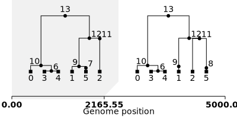
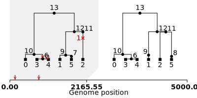

```python
import msprime
from IPython.display import SVG, display
import tskit_arg_visualizer
```


```python
# Simulate an ancestral history for 3 diploid samples under the coalescent
# with recombination on a 5kb region.
ts = msprime.sim_ancestry(
    samples=3,
    recombination_rate=5e-9,
    sequence_length=5_000,
    population_size=10_000,
    record_full_arg=True,
    discrete_genome=False)
```


```python
mutated_ts = msprime.sim_mutations(ts, rate=1e-8, random_seed=54321)
```


```python
d3arg = tskit_arg_visualizer.D3ARG.from_ts(ts=mutated_ts)
w, h = 450, 300  # width and height
d3arg.draw(w, h, edge_type="ortho", sample_order=[2, 5, 1, 4, 3, 0])
```


<style>.d3arg {
    position: relative;
    display: flex;
    flex-direction: column;
    justify-content: center;
    align-items: center;
    background-color: white;
    padding: 20px 20px 60px 20px;
}

.d3arg:hover .dashboard {
    visibility: visible;
}

.dashboard {
    display: flex;
    visibility: hidden;
}

.dashboard button {
    position: relative;
    font-size: 30px;
    border: 0px;
    background-color: white;
    width: 30px;
    height: 30px;
}

.dashboard button .tip {
    width: 120px;
    font-size: 12px;
    background-color: lightgrey;
    color: #053e4e;
    text-align: center;
    padding: 5px 0px;
    position: absolute;
    z-index: 1;
    top: 100%;
    left: 50%; 
    margin-left: -60px;
    visibility: hidden;
}

.dashboard button:hover .desc {
    visibility: visible;
}

.dashboard path {
    fill: grey;
}

.dashboard button:hover path {
    fill: #053e4e;
}

.dashboard button:active path {
    fill: #1eebb1;
}

.yaxis path {
    stroke: #053e4e;
    stroke-width: 3px;
}

.yaxis line {
    stroke: #053e4e;
    stroke-width: 3px;
}

.yaxis text {
    fill: #053e4e;
    stroke: 1px;
}

.node {
    fill: #1eebb1;
    stroke: #053e4e;
    stroke-width: 4px;
}

.hiddennode {
    fill: lightgrey;
    stroke: lightgrey;
    stroke-width: 4px;
}

.underlink {
    stroke: #ffffff;
    stroke-width: 12px;
    fill: none;
}

.link {
    stroke: #053e4e;
    stroke-width: 4px;
    fill: none;
}

.hiddenlink {
    stroke: lightgrey;
    stroke-width: 4px;
    fill: none;
}

.labels {
    text-anchor: middle;
}

.label {
    fill: #053e4e;
    font-family: Arial;
    font-size: 12px;
}

.hiddenlabel {
    fill: lightgrey;
    font-family: Arial;
    font-size: 12px;
}

svg {
    display: block;
}

button {
    display: block;
    cursor: pointer;
}

.saving {
    display: flex;
    flex-direction: row;
}

.saving .message {
    display: none;
}</style><script src='https://d3js.org/d3.v7.min.js'></script><div id='arg_4473289654'class='d3arg' style='min-width:540px; min-height:455px;'></div><script>var line = d3.line();
var step = d3.line().curve(d3.curveStep);
var stepAfter = d3.line().curve(d3.curveStepAfter);
var stepBefore = d3.line().curve(d3.curveStepBefore);

function draw_force_diagram() {

    var graph = {'nodes': [{'id': 0, 'flag': 1, 'time': 0.0, 'time_01': 1.0, 'logtime_01': 1.0, 'rank_01': 1.0, 'child_of': [10], 'parent_of': [], 'label': '0', 'fx': 450.0, 'fy': 250.0, 'y': 250.0}, {'id': 1, 'flag': 1, 'time': 0.0, 'time_01': 1.0, 'logtime_01': 1.0, 'rank_01': 1.0, 'child_of': [9], 'parent_of': [], 'label': '1', 'fx': 240.0, 'fy': 250.0, 'y': 250.0}, {'id': 2, 'flag': 1, 'time': 0.0, 'time_01': 1.0, 'logtime_01': 1.0, 'rank_01': 1.0, 'child_of': [11], 'parent_of': [], 'label': '2', 'fx': 100.0, 'fy': 250.0, 'y': 250.0}, {'id': 3, 'flag': 1, 'time': 0.0, 'time_01': 1.0, 'logtime_01': 1.0, 'rank_01': 1.0, 'child_of': [6], 'parent_of': [], 'label': '3', 'fx': 380.0, 'fy': 250.0, 'y': 250.0}, {'id': 4, 'flag': 1, 'time': 0.0, 'time_01': 1.0, 'logtime_01': 1.0, 'rank_01': 1.0, 'child_of': [6], 'parent_of': [], 'label': '4', 'fx': 310.0, 'fy': 250.0, 'y': 250.0}, {'id': 5, 'flag': 1, 'time': 0.0, 'time_01': 1.0, 'logtime_01': 1.0, 'rank_01': 1.0, 'child_of': [7], 'parent_of': [], 'label': '5', 'fx': 170.0, 'fy': 250.0, 'y': 250.0}, {'id': 6, 'flag': 0, 'time': 220.4527441218569, 'time_01': 0.9880401587755187, 'logtime_01': 0.45018602023491705, 'rank_01': 0.8571428571428572, 'child_of': [10], 'parent_of': [3, 4], 'label': '6', 'x': 275.0, 'fy': 221.42857142857144, 'y': 221.42857142857144}, {'id': 7, 'flag': 131072, 'time': 1231.2805918618599, 'time_01': 0.9332014648304245, 'logtime_01': 0.2754321114686772, 'rank_01': 0.7142857142857143, 'child_of': [9], 'parent_of': [5], 'x_pos_reference': 5, 'label': '7/8', 'x': 275.0, 'fy': 192.85714285714286, 'y': 192.85714285714286}, {'id': 9, 'flag': 0, 'time': 1720.2334697010947, 'time_01': 0.9066751505016808, 'logtime_01': 0.24140864210115487, 'rank_01': 0.5714285714285714, 'child_of': [12], 'parent_of': [1, 7], 'label': '9', 'x': 275.0, 'fy': 164.28571428571428, 'y': 164.28571428571428}, {'id': 10, 'flag': 0, 'time': 2030.197794651527, 'time_01': 0.8898591923859063, 'logtime_01': 0.2245499115843398, 'rank_01': 0.4285714285714286, 'child_of': [13], 'parent_of': [0, 6], 'label': '10', 'x': 275.0, 'fy': 135.71428571428572, 'y': 135.71428571428572}, {'id': 11, 'flag': 0, 'time': 10939.096658575902, 'time_01': 0.40654011953008307, 'logtime_01': 0.05311549653488634, 'rank_01': 0.2857142857142858, 'child_of': [12], 'parent_of': [2, 7], 'label': '11', 'x': 275.0, 'fy': 107.14285714285717, 'y': 107.14285714285717}, {'id': 12, 'flag': 0, 'time': 11045.202029493497, 'time_01': 0.4007837684613129, 'logtime_01': 0.05213279009170402, 'rank_01': 0.1428571428571429, 'child_of': [13], 'parent_of': [9, 11], 'label': '12', 'x': 275.0, 'fy': 78.57142857142858, 'y': 78.57142857142858}, {'id': 13, 'flag': 0, 'time': 18432.74839389992, 'time_01': 0.0, 'logtime_01': -5.523359571046882e-06, 'rank_01': 0.0, 'child_of': [], 'parent_of': [10, 12], 'label': '13', 'x': 275.0, 'fy': 50.0, 'y': 50.0}], 'links': [{'source': 10, 'target': 0, 'bounds': '0.0-5000.0', 'alt_parent': '', 'alt_child': 6, 'region_fraction': 1.0}, {'source': 9, 'target': 1, 'bounds': '0.0-5000.0', 'alt_parent': '', 'alt_child': 7, 'region_fraction': 1.0}, {'source': 11, 'target': 2, 'bounds': '0.0-5000.0', 'alt_parent': '', 'alt_child': 7, 'region_fraction': 1.0}, {'source': 6, 'target': 3, 'bounds': '0.0-5000.0', 'alt_parent': '', 'alt_child': 4, 'region_fraction': 1.0}, {'source': 6, 'target': 4, 'bounds': '0.0-5000.0', 'alt_parent': '', 'alt_child': 3, 'region_fraction': 1.0}, {'source': 7, 'target': 5, 'bounds': '0.0-2165.5520936474204 2165.5520936474204-5000.0', 'alt_parent': '', 'alt_child': '', 'region_fraction': 1.0}, {'source': 10, 'target': 6, 'bounds': '0.0-5000.0', 'alt_parent': '', 'alt_child': 0, 'region_fraction': 1.0}, {'source': 9, 'target': 7, 'bounds': '0.0-2165.5520936474204', 'alt_parent': 11, 'alt_child': 1, 'region_fraction': 0.4331104187294841}, {'source': 11, 'target': 7, 'bounds': '2165.5520936474204-5000.0', 'alt_parent': 9, 'alt_child': 2, 'region_fraction': 0.5668895812705159}, {'source': 12, 'target': 9, 'bounds': '0.0-5000.0', 'alt_parent': '', 'alt_child': 11, 'region_fraction': 1.0}, {'source': 13, 'target': 10, 'bounds': '0.0-5000.0', 'alt_parent': '', 'alt_child': 12, 'region_fraction': 1.0}, {'source': 12, 'target': 11, 'bounds': '0.0-5000.0', 'alt_parent': '', 'alt_child': 9, 'region_fraction': 1.0}, {'source': 13, 'target': 12, 'bounds': '0.0-5000.0', 'alt_parent': '', 'alt_child': 10, 'region_fraction': 1.0}], 'breakpoints': [{'start': 0, 'stop': 2165.5520936474204, 'x_pos_01': 0.0, 'width_01': 0.4331104187294841, 'x_pos': 50.0, 'width': 194.89968842826784}, {'start': 2165.5520936474204, 'stop': 5000.0, 'x_pos_01': 0.4331104187294841, 'width_01': 0.5668895812705159, 'x_pos': 244.89968842826784, 'width': 255.10031157173216}]};
    var y_axis = {'include_labels': 'true', 'ticks': [250.0, 221.42857142857144, 192.85714285714286, 164.28571428571428, 135.71428571428572, 107.14285714285717, 78.57142857142858, 50.0], 'text': [0, 220, 1231, 1720, 2030, 10939, 11045, 18433], 'max_min': [250.0, 50.0], 'scale': 'rank'};
    var subset = [0, 1, 2, 3, 4, 5, 6, 7, 9, 10, 11, 12, 13];
    var evenly_distributed_positions = [100.0, 170.0, 240.0, 310.0, 380.0, 450.0];

    var dashboard = d3.select("#arg_4473289654").append("div").attr("class", "dashboard");

    var clipboard = dashboard.append("button")
        .on("click", function() {
            navigator.clipboard.writeText("{'arg': {'nodes': [{'id': 0, 'flag': 1, 'time': 0.0, 'time_01': 1.0, 'logtime_01': 1.0, 'rank_01': 1.0, 'child_of': [10], 'parent_of': [], 'label': '0', 'fx': 450.0, 'fy': 250.0, 'y': 250.0}, {'id': 1, 'flag': 1, 'time': 0.0, 'time_01': 1.0, 'logtime_01': 1.0, 'rank_01': 1.0, 'child_of': [9], 'parent_of': [], 'label': '1', 'fx': 240.0, 'fy': 250.0, 'y': 250.0}, {'id': 2, 'flag': 1, 'time': 0.0, 'time_01': 1.0, 'logtime_01': 1.0, 'rank_01': 1.0, 'child_of': [11], 'parent_of': [], 'label': '2', 'fx': 100.0, 'fy': 250.0, 'y': 250.0}, {'id': 3, 'flag': 1, 'time': 0.0, 'time_01': 1.0, 'logtime_01': 1.0, 'rank_01': 1.0, 'child_of': [6], 'parent_of': [], 'label': '3', 'fx': 380.0, 'fy': 250.0, 'y': 250.0}, {'id': 4, 'flag': 1, 'time': 0.0, 'time_01': 1.0, 'logtime_01': 1.0, 'rank_01': 1.0, 'child_of': [6], 'parent_of': [], 'label': '4', 'fx': 310.0, 'fy': 250.0, 'y': 250.0}, {'id': 5, 'flag': 1, 'time': 0.0, 'time_01': 1.0, 'logtime_01': 1.0, 'rank_01': 1.0, 'child_of': [7], 'parent_of': [], 'label': '5', 'fx': 170.0, 'fy': 250.0, 'y': 250.0}, {'id': 6, 'flag': 0, 'time': 220.4527441218569, 'time_01': 0.9880401587755187, 'logtime_01': 0.45018602023491705, 'rank_01': 0.8571428571428572, 'child_of': [10], 'parent_of': [3, 4], 'label': '6', 'x': 275.0, 'fy': 221.42857142857144, 'y': 221.42857142857144}, {'id': 7, 'flag': 131072, 'time': 1231.2805918618599, 'time_01': 0.9332014648304245, 'logtime_01': 0.2754321114686772, 'rank_01': 0.7142857142857143, 'child_of': [9], 'parent_of': [5], 'x_pos_reference': 5, 'label': '7/8', 'x': 275.0, 'fy': 192.85714285714286, 'y': 192.85714285714286}, {'id': 9, 'flag': 0, 'time': 1720.2334697010947, 'time_01': 0.9066751505016808, 'logtime_01': 0.24140864210115487, 'rank_01': 0.5714285714285714, 'child_of': [12], 'parent_of': [1, 7], 'label': '9', 'x': 275.0, 'fy': 164.28571428571428, 'y': 164.28571428571428}, {'id': 10, 'flag': 0, 'time': 2030.197794651527, 'time_01': 0.8898591923859063, 'logtime_01': 0.2245499115843398, 'rank_01': 0.4285714285714286, 'child_of': [13], 'parent_of': [0, 6], 'label': '10', 'x': 275.0, 'fy': 135.71428571428572, 'y': 135.71428571428572}, {'id': 11, 'flag': 0, 'time': 10939.096658575902, 'time_01': 0.40654011953008307, 'logtime_01': 0.05311549653488634, 'rank_01': 0.2857142857142858, 'child_of': [12], 'parent_of': [2, 7], 'label': '11', 'x': 275.0, 'fy': 107.14285714285717, 'y': 107.14285714285717}, {'id': 12, 'flag': 0, 'time': 11045.202029493497, 'time_01': 0.4007837684613129, 'logtime_01': 0.05213279009170402, 'rank_01': 0.1428571428571429, 'child_of': [13], 'parent_of': [9, 11], 'label': '12', 'x': 275.0, 'fy': 78.57142857142858, 'y': 78.57142857142858}, {'id': 13, 'flag': 0, 'time': 18432.74839389992, 'time_01': 0.0, 'logtime_01': -5.523359571046882e-06, 'rank_01': 0.0, 'child_of': [], 'parent_of': [10, 12], 'label': '13', 'x': 275.0, 'fy': 50.0, 'y': 50.0}], 'links': [{'source': 10, 'target': 0, 'bounds': '0.0-5000.0', 'alt_parent': '', 'alt_child': 6, 'region_fraction': 1.0}, {'source': 9, 'target': 1, 'bounds': '0.0-5000.0', 'alt_parent': '', 'alt_child': 7, 'region_fraction': 1.0}, {'source': 11, 'target': 2, 'bounds': '0.0-5000.0', 'alt_parent': '', 'alt_child': 7, 'region_fraction': 1.0}, {'source': 6, 'target': 3, 'bounds': '0.0-5000.0', 'alt_parent': '', 'alt_child': 4, 'region_fraction': 1.0}, {'source': 6, 'target': 4, 'bounds': '0.0-5000.0', 'alt_parent': '', 'alt_child': 3, 'region_fraction': 1.0}, {'source': 7, 'target': 5, 'bounds': '0.0-2165.5520936474204 2165.5520936474204-5000.0', 'alt_parent': '', 'alt_child': '', 'region_fraction': 1.0}, {'source': 10, 'target': 6, 'bounds': '0.0-5000.0', 'alt_parent': '', 'alt_child': 0, 'region_fraction': 1.0}, {'source': 9, 'target': 7, 'bounds': '0.0-2165.5520936474204', 'alt_parent': 11, 'alt_child': 1, 'region_fraction': 0.4331104187294841}, {'source': 11, 'target': 7, 'bounds': '2165.5520936474204-5000.0', 'alt_parent': 9, 'alt_child': 2, 'region_fraction': 0.5668895812705159}, {'source': 12, 'target': 9, 'bounds': '0.0-5000.0', 'alt_parent': '', 'alt_child': 11, 'region_fraction': 1.0}, {'source': 13, 'target': 10, 'bounds': '0.0-5000.0', 'alt_parent': '', 'alt_child': 12, 'region_fraction': 1.0}, {'source': 12, 'target': 11, 'bounds': '0.0-5000.0', 'alt_parent': '', 'alt_child': 9, 'region_fraction': 1.0}, {'source': 13, 'target': 12, 'bounds': '0.0-5000.0', 'alt_parent': '', 'alt_child': 10, 'region_fraction': 1.0}], 'breakpoints': [{'start': 0, 'stop': 2165.5520936474204, 'x_pos_01': 0.0, 'width_01': 0.4331104187294841, 'x_pos': 50.0, 'width': 194.89968842826784}, {'start': 2165.5520936474204, 'stop': 5000.0, 'x_pos_01': 0.4331104187294841, 'width_01': 0.5668895812705159, 'x_pos': 244.89968842826784, 'width': 255.10031157173216}]}, 'width': 500, 'height': 375, 'y_axis': {'include_labels': 'true', 'ticks': [250.0, 221.42857142857144, 192.85714285714286, 164.28571428571428, 135.71428571428572, 107.14285714285717, 78.57142857142858, 50.0], 'text': [0, 220, 1231, 1720, 2030, 10939, 11045, 18433], 'max_min': [250.0, 50.0], 'scale': 'rank'}, 'tree_highlighting': 'true', 'edge_type': 'ortho', 'variable_edge_width': 'false', 'subset_nodes': [0, 1, 2, 3, 4, 5, 6, 7, 9, 10, 11, 12, 13], 'include_node_labels': 'true', 'evenly_distributed_positions': [100.0, 170.0, 240.0, 310.0, 380.0, 450.0]}".replace(/'nodes': .*'links'/, "'nodes': " + JSON.stringify(graph.nodes) + ", 'links'").replaceAll("'", '"'));
            d3.select("#arg_4473289654 .copymessage").style("visibility", "visible");
            setTimeout( function() {
                d3.select("#arg_4473289654 .copymessage").style("visibility", "hidden");
            }, 1000);
        });
    clipboard.append("svg") //<!--! Font Awesome Free 6.4.2 by @fontawesome - https://fontawesome.com License - https://fontawesome.com/license (Commercial License) Copyright 2023 Fonticons, Inc. -->
        .attr("xmlns", "http://www.w3.org/2000/svg")
        .attr("viewBox", "0 0 448 512")
        .append("path")
        .attr("d", "M208 0H332.1c12.7 0 24.9 5.1 33.9 14.1l67.9 67.9c9 9 14.1 21.2 14.1 33.9V336c0 26.5-21.5 48-48 48H208c-26.5 0-48-21.5-48-48V48c0-26.5 21.5-48 48-48zM48 128h80v64H64V448H256V416h64v48c0 26.5-21.5 48-48 48H48c-26.5 0-48-21.5-48-48V176c0-26.5 21.5-48 48-48z");
    clipboard.append("span").attr("class", "tip desc").text("Copy To Clipboard");
    clipboard.append("span").attr("class", "tip copymessage").text("Copied!");

    var reheat = dashboard.append("button")
        .on("click", function(event) {
            if (!event.active) simulation.alphaTarget(0.3).restart();       
            var order = d3.selectAll("#arg_4473289654 .sample").data().sort((a, b) => d3.ascending(a.x, b.x)).map(a => a.id);;
            d3.selectAll("#arg_4473289654 .node").classed("unfix", function(d) {
                if (d.flag != 1) {
                    delete d.fx;
                } else {
                    d.fx = evenly_distributed_positions[order.indexOf(d.id)];
                }
            });
        });
    reheat.append("svg") //<!--! Font Awesome Free 6.4.2 by @fontawesome - https://fontawesome.com License - https://fontawesome.com/license (Commercial License) Copyright 2023 Fonticons, Inc. -->
        .attr("xmlns", "http://www.w3.org/2000/svg")
        .attr("viewBox", "0 0 384 512")
        .append("path")
        .attr("d", "M153.6 29.9l16-21.3C173.6 3.2 180 0 186.7 0C198.4 0 208 9.6 208 21.3V43.5c0 13.1 5.4 25.7 14.9 34.7L307.6 159C356.4 205.6 384 270.2 384 337.7C384 434 306 512 209.7 512H192C86 512 0 426 0 320v-3.8c0-48.8 19.4-95.6 53.9-130.1l3.5-3.5c4.2-4.2 10-6.6 16-6.6C85.9 176 96 186.1 96 198.6V288c0 35.3 28.7 64 64 64s64-28.7 64-64v-3.9c0-18-7.2-35.3-19.9-48l-38.6-38.6c-24-24-37.5-56.7-37.5-90.7c0-27.7 9-54.8 25.6-76.9z");
    reheat.append("span").attr("class", "tip desc").text("Reheat Simulation");

    var evenly_distribute = dashboard.append("button")
        .on("click", function() {
            var order = d3.selectAll("#arg_4473289654 .sample").data().sort((a, b) => d3.ascending(a.x, b.x)).map(a => a.id);;
            d3.selectAll("#arg_4473289654 .sample").classed("distribute", function(d) {
                d.fx = evenly_distributed_positions[order.indexOf(d.id)];
            });
        });
    evenly_distribute.append("svg") //<!--! Font Awesome Free 6.4.2 by @fontawesome - https://fontawesome.com License - https://fontawesome.com/license (Commercial License) Copyright 2023 Fonticons, Inc. -->
        .attr("xmlns", "http://www.w3.org/2000/svg")
        .attr("viewBox", "0 0 512 512")
        .append("path")
        .attr("d", "M504.3 273.6c4.9-4.5 7.7-10.9 7.7-17.6s-2.8-13-7.7-17.6l-112-104c-7-6.5-17.2-8.2-25.9-4.4s-14.4 12.5-14.4 22l0 56-192 0 0-56c0-9.5-5.7-18.2-14.4-22s-18.9-2.1-25.9 4.4l-112 104C2.8 243 0 249.3 0 256s2.8 13 7.7 17.6l112 104c7 6.5 17.2 8.2 25.9 4.4s14.4-12.5 14.4-22l0-56 192 0 0 56c0 9.5 5.7 18.2 14.4 22s18.9 2.1 25.9-4.4l112-104z")
    evenly_distribute.append("span").attr("class", "tip desc").text("Space Samples");

    var svg = d3.select("#arg_4473289654").append("svg")
        .attr("width", 500)
        .attr("height", 375)
        .style("padding-top", "10px");

    var result = y_axis.ticks.map(function (x) { 
        return parseInt(x, 10); 
    });


    if (y_axis.include_labels == "true") {
        var bottom = 375 - 50;
        if (true) {
            bottom = 375 - 125;
        }
        var yscale = d3.scaleLinear() 
            .domain([y_axis.max_min[0], y_axis.max_min[1]]) 
            .range([bottom, 50]); 

        var y_axis_text = y_axis.text;

        var y_axis = d3.axisRight().scale(yscale)
            .tickValues(result)
            .tickFormat((d, i) => y_axis_text[i]); 

        var y_axis_labels = svg
            .append("g")
            .attr("class", "yaxis")
            .attr("transform", "translate(5,0)")
            .call(y_axis);
    }

    var simulation = d3
        .forceSimulation(graph.nodes)
        .force("link", d3.forceLink()
            .id(function(d) {
                return d.id;
            })
            .links(graph.links)
        )
        .force("charge", d3.forceManyBody().strength(-10))
        .on("tick", ticked);

    var link_container = svg
        .append("g")
        .attr("class", "links")
        .selectAll("path")
        .data(graph.links)
        .enter()
        .append("g")
        .attr("bounds", function(d) {
            return d.bounds;
        });

    var underlink = link_container
        .append("path")
        .attr("class", "underlink");

    var link = link_container
        .append("path")
        .attr("class", function(d) {
            if (subset.includes(d.source.id) & subset.includes(d.target.id)) {
                return "link"
            } else {
                return "hiddenlink"
            }
        });

    if (false) {
        link
            .style("stroke-width", function(d) {
                return d.region_fraction * 7 + 1;
            });
    }

    if (true) {
        link
            .on('mouseover', function (event, d) {
                d3.select(this)
                    .style('stroke', '#1eebb1')
                    .style("cursor", "pointer");
                d3.select("#arg_4473289654 .breakpoints")
                    .selectAll("rect")
                        .filter(function(j) {
                            return d.bounds.split(" ").some(function(region) {
                                region = region.split("-");
                                return (parseFloat(region[0]) <= j.start) & (parseFloat(region[1]) >= j.stop)
                            });
                        })
                        .style('fill', '#1eebb1');
            })
            .on('mouseout', function (d, i) {
                d3.select(this)
                    .style('stroke', '#053e4e')
                    .style("cursor", "default")
                d3.select("#arg_4473289654 .breakpoints").selectAll("rect")
                    .style("fill", "#053e4e")
            });
    }

    var node = svg
        .append("g")
        .attr("class", "nodes")
        .selectAll("circle")
        .data(graph.nodes)
        .enter()
        .append("circle")
        .attr("id", function(d) {
            return String(4473289654) + "_node" + d.id
        })
        .attr("class", function(d) {
            var classy = ""
            if (subset.includes(d.id)) {
                classy += "node";
            } else {
                classy += "hiddennode";
            }
            if (d.flag == 1) {
                classy += " sample";
            }
            return classy
        })
        .attr("parents", function(d) {
            return d.child_of.toString().replace(",", " ")
        })
        .attr("children", function(d) {
            return d.parent_of.toString().replace(",", " ")
        })
        .attr("r", 7)
        .call(
            d3
                .drag()
                .on("start", dragstarted)
                .on("drag", dragged)
        )
        .on('mouseover', function (d, i) {
            d3.select(this)
                .style("cursor", "pointer")
        });


    if (true) {
        var label = svg
            .append("g")
            .attr("class", "labels")
            .selectAll("text")
            .data(graph.nodes)
            .enter()
            .append("text")
                .attr("class", function(d) {
                    if (subset.includes(d.id)) {
                        return "label"
                    } else {
                        return "hiddenlabel"
                    }
                })
                .text(function (d) { return d.label; });
    };

    function determine_path_type(d) {
        path_type = ""
        var start_position_x = d.source.x;
        var start_position_y = d.source.y;
        var stop_position_x = d.target.x;
        var stop_position_y = d.target.y;
        var vnub = Math.min((stop_position_y-start_position_y)/2, 20);
        if ("y_axis.scale" == "time" | "y_axis.scale" == "log_time") {
            vnub = 0;
        }
        var alt_child = document.getElementById(String(4473289654) + "_node" + d.alt_child);
        if (alt_child != null) {
            var alt_child_x = alt_child.getAttribute("cx");
            var alt_child_y = alt_child.getAttribute("cy");
        }
        if (d.source.flag == 131072) {
            path_type += "r0";
            start_position_y = d.source.y + vnub;
        } else {
            if (d.target.y < alt_child_y) {
                if (d.target.x < d.source.x) {
                    if (d.target.x < d.source.x - 40) {
                        path_type += "tL";
                    } else {
                        path_type += "fL";
                    }
                    start_position_x = d.source.x - 20;
                } else {
                    if (d.target.x > d.source.x + 40) {
                        path_type += "tR";
                    } else {
                        path_type += "fR";
                    }
                    start_position_x = d.source.x + 20;
                }
            } else if (d.target.y > alt_child_y) {
                if (alt_child_x < d.source.x) {
                    if (d.target.x < d.source.x + 40) {
                        path_type += "fR";
                    } else {
                        path_type += "tR";
                    }
                    start_position_x = d.source.x + 20;
                } else {
                    if (d.target.x > d.source.x - 40) {
                        path_type += "fL";
                    } else {
                        path_type += "tL";
                    }
                    start_position_x = d.source.x - 20;
                }
            } else {
                if (d.target.x < alt_child_x) {
                    if (d.target.x < d.source.x - 40) {
                        path_type += "tL";
                    } else {
                        path_type += "fL";
                    }
                    start_position_x = d.source.x - 20;
                } else if (d.target.x > alt_child_x) {
                    if (d.target.x > d.source.x + 40) {
                        path_type += "tR";
                    } else {
                        path_type += "fR";
                    }
                    start_position_x = d.source.x + 20;
                } else {
                    if (d.index % 2 == 0) {
                        path_type += "fL";
                        start_position_x = d.source.x - 20;
                    } else {
                        path_type += "fR";
                        start_position_x = d.source.x + 20;
                    }
                }
            }
        }
        var alt_parent = document.getElementById(String(4473289654) + "_node" + d.alt_parent);
        if (alt_parent != null) {
            var alt_parent_x = alt_parent.getAttribute("cx");
            var alt_parent_y = alt_parent.getAttribute("cy");
        }
        if (d.target.flag == 131072) {
            if (d.source.y < alt_parent_y) {
                if (alt_parent_x < d.target.x) {
                    if (d.source.x < d.target.x + 40) {
                        path_type += "fR";
                    } else {
                        path_type += "tR";
                    }
                    stop_position_x = d.target.x + 20;
                } else {
                    if (d.source.x > d.target.x - 40) {
                        path_type += "fL";
                    } else {
                        path_type += "tL";
                    }
                    stop_position_x = d.target.x - 20;
                }
            } else if (d.source.y > alt_parent_y) {
                if (d.source.x < d.target.x) {
                    if (d.source.x < d.target.x - 40) {
                        path_type += "tL";
                    } else {
                        path_type += "fL";
                    }
                    stop_position_x = d.target.x - 20;
                } else {
                    if (d.source.x > d.target.x + 40) {
                        path_type += "tR";
                    } else {
                        path_type += "fR";
                    }
                    stop_position_x = d.target.x + 20;
                }
            } else {
                if (d.index % 2 == 0) {
                    path_type += "fL";
                    stop_position_x = d.target.x - 20;
                } else {
                    path_type += "fR";
                    stop_position_x = d.target.x + 20;
                }
            }
        } else {
            path_type += "b0";
            stop_position_y = d.target.y - vnub;
        }
        if (path_type == "fLb0" ) {
            if (start_position_x >= stop_position_x) {
                path_type = "tLb0";
            }
        } else if (path_type == "fRb0") {
            if (start_position_x <= stop_position_x) {
                path_type = "tRb0";
            }
        } else if (path_type == "r0fL") {
            if (start_position_x <= stop_position_x) {
                path_type = "r0tL";
            }
        } else if (path_type == "r0fR") {
            if (start_position_x >= stop_position_x) {
                path_type = "r0tR";
            }
        } else if (path_type == "fLfL") {
            if (start_position_x <= stop_position_x) {
                path_type = "fLtL";
            } else {
                path_type = "tLfL";
            }
        } else if (path_type == "fRfR") {
            if (start_position_x >= stop_position_x) {
                path_type = "fRtR";
            } else {
                path_type = "tRfR";
            }
        }
        if ((d.source.id == 60) & (d.target.id == 35)) {
            path_type = "r0b0";
            start_position_x = d.source.x;
            start_position_y = d.source.y + vnub;
            stop_position_x = d.target.x;
            stop_position_y = d.target.y - vnub;
        }
        return [path_type, start_position_x, start_position_y, stop_position_x, stop_position_y];
    }

    function ticked() {

        node
            .attr("cx", function(d) {
                if (y_axis.include_labels == "false") {
                    return d.x = Math.max(50, Math.min(500-50, d.x));
                } else {
                    return d.x = Math.max(100, Math.min(500-50, d.x));
                }
            })
            .attr("cy", function(d) {
                return d.y;
            });

        underlink
            .attr("d", function(d) {
                if ("ortho" == "ortho") {
                    const output = determine_path_type(d);

                    const path_type = output[0];
                    const simple_path_type = Array.from(path_type)[0] + Array.from(path_type)[2];
                    const start_position_x = output[1];
                    const start_position_y = output[2];
                    const stop_position_x = output[3];
                    const stop_position_y = output[4];

                    const after_paths = ["rf", "tb", "tf"];
                    const before_paths = ["rt", "fb", "ft"];
                    const step_paths = ["tt"];
                    const mid_paths = ["rb", "ff"];

                    if (after_paths.includes(simple_path_type)) {
                        return line([[d.source.x, d.source.y],[start_position_x, start_position_y]]) + stepAfter([[start_position_x, start_position_y],[stop_position_x, stop_position_y]]) + line([[stop_position_x, stop_position_y], [d.target.x, d.target.y]]);
                    } else if (before_paths.includes(simple_path_type)) {
                        return line([[d.source.x, d.source.y],[start_position_x, start_position_y]]) + stepBefore([[start_position_x, start_position_y],[stop_position_x, stop_position_y]]) + line([[stop_position_x, stop_position_y], [d.target.x, d.target.y]]);
                    } else if (step_paths.includes(simple_path_type)) {
                        return line([[d.source.x, d.source.y],[start_position_x, start_position_y]]) + step([[start_position_x, start_position_y],[stop_position_x, stop_position_y]]) + line([[stop_position_x, stop_position_y], [d.target.x, d.target.y]]);
                    } else if (mid_paths.includes(simple_path_type)) {
                        return line([[d.source.x, d.source.y],[start_position_x, start_position_y]]) + line([[start_position_x, start_position_y],[start_position_x, start_position_y + (stop_position_y - start_position_y)/2]]) + line([[start_position_x, start_position_y + (stop_position_y - start_position_y)/2],[stop_position_x, start_position_y + (stop_position_y - start_position_y)/2]]) + line([[stop_position_x, start_position_y + (stop_position_y - start_position_y)/2], [stop_position_x, stop_position_y]]) + line([[stop_position_x, stop_position_y], [d.target.x, d.target.y]]);
                    }
                }
            });

        link
            .attr("path_type", function(d) {
                return determine_path_type(d)[0];
            })
            .attr("d", function(d) {
                if ("ortho" == "ortho") {
                    const output = determine_path_type(d);

                    const path_type = output[0];
                    const simple_path_type = Array.from(path_type)[0] + Array.from(path_type)[2];
                    const start_position_x = output[1];
                    const start_position_y = output[2];
                    const stop_position_x = output[3];
                    const stop_position_y = output[4];

                    const after_paths = ["rf", "tb", "tf"];
                    const before_paths = ["rt", "fb", "ft"];
                    const step_paths = ["tt"];
                    const mid_paths = ["rb", "ff"];

                    if (after_paths.includes(simple_path_type)) {
                        return line([[d.source.x, d.source.y],[start_position_x, start_position_y]]) + stepAfter([[start_position_x, start_position_y],[stop_position_x, stop_position_y]]) + line([[stop_position_x, stop_position_y], [d.target.x, d.target.y]]);
                    } else if (before_paths.includes(simple_path_type)) {
                        return line([[d.source.x, d.source.y],[start_position_x, start_position_y]]) + stepBefore([[start_position_x, start_position_y],[stop_position_x, stop_position_y]]) + line([[stop_position_x, stop_position_y], [d.target.x, d.target.y]]);
                    } else if (step_paths.includes(simple_path_type)) {
                        return line([[d.source.x, d.source.y],[start_position_x, start_position_y]]) + step([[start_position_x, start_position_y],[stop_position_x, stop_position_y]]) + line([[stop_position_x, stop_position_y], [d.target.x, d.target.y]]);
                    } else if (mid_paths.includes(simple_path_type)) {
                        return line([[d.source.x, d.source.y],[start_position_x, start_position_y]]) + line([[start_position_x, start_position_y],[start_position_x, start_position_y + (stop_position_y - start_position_y)/2]]) + line([[start_position_x, start_position_y + (stop_position_y - start_position_y)/2],[stop_position_x, start_position_y + (stop_position_y - start_position_y)/2]]) + line([[stop_position_x, start_position_y + (stop_position_y - start_position_y)/2], [stop_position_x, stop_position_y]]) + line([[stop_position_x, stop_position_y], [d.target.x, d.target.y]]);
                    }
                } else if ("ortho" == "line") {
                    if (d.source.id == d.alt_parent) {
                        var leftOrRight = 20;
                        if (d.index % 2 == 0) {
                            leftOrRight = -20;
                        }
                        return "M " + d.source.x + " " + d.source.y + " C " + (d.source.x + leftOrRight).toString() + " " +  (d.source.y - 10).toString() + ", " + (d.target.x + leftOrRight).toString() + " " + (d.target.y + 10).toString() + ", " + d.target.x + " " + d.target.y;
                    } else {
                        return line([[d.source.x, d.source.y], [d.target.x, d.target.y]]);
                    }
                }
            });

        function determine_label_positioning(d) {
            if (d.flag == 131072 || d.parent_of.length == 0 || d.child_of.length == 0) {
                return "c";
            } else if (d.child_of.length == 1) {
                var parent = document.getElementById(String(4473289654) + "_node" + d.child_of[0])
                if (parent != null) {
                    var parent_x = parent.getAttribute("cx");
                    if (parent_x > d.x) {
                        return "l";
                    } else {
                        return "r";
                    }
                } else {
                    return "r";
                }
            } else {
                return "r";
            }
        };

        if (true) {

            label
                .attr("x", function(d) {
                    var positioning = determine_label_positioning(d);
                    if (positioning == "l") {
                        return d.x - 15;
                    } else if (positioning == "r") {
                        return d.x + 15;
                    } else {
                        return d.x;
                    }
                })
                .style("text-anchor", function(d) {
                    var positioning = determine_label_positioning(d);
                    if (positioning == "l") {
                        return "end";
                    } else if (positioning == "r") {
                        return "start";
                    } else {
                        return "middle";
                    }
                })
                .attr("y", function(d) {
                    if (d.parent_of.length == 0) {
                        return d.y + 25;
                    } else {
                        return d.y - 15;
                    }
                });
        };
    }

    function dragstarted(event, d) {
        if (!event.active) simulation.alphaTarget(0.3).restart();
        d.fx = d.x;
    }

    function dragged(event, d) {
        d.fx = event.x;
    }

    if (true) {

        var th_group = svg.append("g").attr("class", "tree_highlighting");

        th_group
            .append("g")
            .attr("class", "breakpoints")
            .selectAll("rect")
            .data(graph.breakpoints)
            .enter()
            .append("rect")
            .attr("start", function(d) {
                return d.start;
            })
            .attr("stop", function(d) {
                return d.stop;
            })
            .attr("x", function(d) {
                return d.x_pos;
            })
            .attr("y", 375-60)
            .attr("width", function(d) {
                return d.width;
            })
            .attr("height", 40)
            .attr("stroke", "#FFFFFF")
            .attr("stroke-width", 5)
            .attr("fill", "#053e4e")
            .on('mouseover', function (event, d) {
                d3.select(this)
                    .style('fill', '#1eebb1')
                    .style("cursor", "pointer");
                var highlight_links = d3.select("#arg_4473289654 .links")
                    .selectAll("g")
                        .filter(function(j) {
                            return j.bounds.split(" ").some(function(region) {
                                region = region.split("-");
                                return (parseFloat(region[1]) > d.start) & (parseFloat(region[0]) < d.stop)
                            });
                        });
                highlight_links.raise();
                //if (false) {
                    highlight_links
                        .select(".link")
                        .style("stroke", "#1eebb1");
                //} else {
                //    highlight_links
                //        .select(".link")
                //        .style("stroke", "#1eebb1")
                //        .style("stroke-width", 7);
                //};
            })
            .on('mouseout', function (d, i) {
                d3.select(this)
                    .style('fill', '#053e4e')
                    .style("cursor", "default");
                //if (false) {
                    d3.selectAll("#arg_4473289654 .link")
                        .style("stroke", "#053e4e");
                //} else {
                //    d3.selectAll("#arg_4473289654 .link")
                //        .style("stroke", "#053e4e")
                //        .style("stroke-width", 3);
                //};     
            });

        var endpoints = th_group.append("g").attr("class", "endpoints");

        endpoints
            .append("text")
                .attr("class", "label")
                .style("text-anchor", "start")
                .text(graph.breakpoints[0].start)
                .attr("x", graph.breakpoints[0].x_pos)
                .attr("y", 375-5);

        endpoints
            .append("text")
                .attr("class", "label")
                .style("text-anchor", "end")
                .text(graph.breakpoints[graph.breakpoints.length-1].stop)
                .attr("x", 500)
                .attr("y", 375-5);
    }
}

draw_force_diagram()</script>


```python
# Visualise the simulated ancestral history.
SVG(ts.draw_svg())
```


    

    


```python
# Visualise the simulated ancestral history with mutations
SVG(mutated_ts.draw_svg())
```


    

    


```python
mutated_ts.tables.sites
```


        <div>
            <style scoped="">
                .tskit-table tbody tr th:only-of-type {vertical-align: middle;}
                .tskit-table tbody tr th {vertical-align: top;}
                .tskit-table tbody td {text-align: right;padding: 0.5em 0.5em;}
                .tskit-table tbody th {padding: 0.5em 0.5em;}
            </style>
            <table border="1" class="tskit-table">
                <thead>
                    <tr>
                        <th>id</th><th>position</th><th>ancestral_state</th><th>metadata</th>
                    </tr>
                </thead>
                <tbody>
                    <tr><td>0</td><td>148</td><td>G</td><td></td></tr>
<tr><td>1</td><td>819</td><td>A</td><td></td></tr>

                </tbody>
            </table>
        </div>


```python
mutated_ts.tables.mutations
```


        <div>
            <style scoped="">
                .tskit-table tbody tr th:only-of-type {vertical-align: middle;}
                .tskit-table tbody tr th {vertical-align: top;}
                .tskit-table tbody td {text-align: right;padding: 0.5em 0.5em;}
                .tskit-table tbody th {padding: 0.5em 0.5em;}
            </style>
            <table border="1" class="tskit-table">
                <thead>
                    <tr>
                        <th>id</th><th>site</th><th>node</th><th>time</th><th>derived_state</th><th>parent</th><th>metadata</th>
                    </tr>
                </thead>
                <tbody>
                    <tr><td>0</td><td>0</td><td>6</td><td>968.70680990</td><td>T</td><td>-1</td><td></td></tr>
<tr><td>1</td><td>1</td><td>2</td><td>8506.38424129</td><td>C</td><td>-1</td><td></td></tr>

                </tbody>
            </table>
        </div>


```python

```
